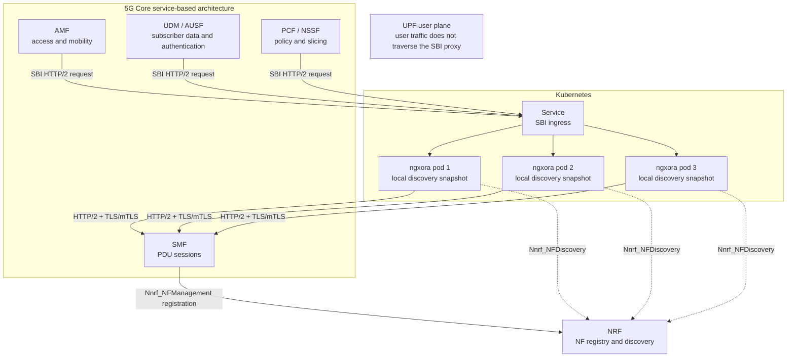

# SBI-ready and 3GPP roadmap

`ngxora` is an SBI-ready HTTP proxy, not a 3GPP-compliant SCP or SEPP. The current
scope is deliberately transport-level: it provides the HTTP/2, TLS, mTLS,
balancing, health and observability primitives on which an SBI-aware component can
be built.

The 3GPP baseline for future protocol semantics is Release 18:

- [TS 29.500](https://portal.3gpp.org/desktopmodules/Specifications/SpecificationDetails.aspx?specificationId=3338) — service-based architecture realization;
- [TS 29.510](https://portal.3gpp.org/desktopmodules/Specifications/SpecificationDetails.aspx?specificationId=3345) — NRF services;
- [TS 29.571](https://www.3gpp.org/ftp/Specs/archive/29_series/29.571/) — common SBI data types.

## How NRF discovery fits

Solid arrows are request traffic. Dashed arrows are control-plane discovery.
NRF is the source of truth; each ngxora pod independently keeps an in-memory
snapshot and performs refresh and health checks. The pods do not replicate NRF
data to one another and do not require Redis or etcd.

## Available now

- upstream HTTP/2 over TLS;
- upstream certificate verification with a custom CA and client-certificate mTLS;
- weighted `round_robin`, `random`, and `consistent_hash` upstream selection;
- consistent-hash keys from one non-empty header value, with socket client IP as
  the fallback;
- active health checks and fail-closed `503` behavior when no backend is usable;
- per-group/per-backend request, latency and readiness metrics;
- structured access logs with `upstream_group` and selected backend;
- read-only NRF NF discovery with per-pod snapshots, bounded stale-on-error,
  preflight health checks, atomic backend replacement and `apiPrefix` routing.

These features do not interpret 3GPP messages. Headers, bodies, HTTP/2 trailers and
unknown methods remain ordinary HTTP data and are forwarded by the Pingora proxy
path.

## Planned Release 18 semantics

1. SCP routing policy: direct and indirect communication selection using the
   applicable TS 29.500 discovery and routing information.
2. SBI error and control handling: `ProblemDetails`, overload/load-control data,
   retries and failure classification without retrying unsafe requests blindly.
3. OAuth 2.0 access-token acquisition and forwarding for NF service access.
4. Conformance fixtures generated from the Release 18 3GPP OpenAPI definitions,
   plus negative and interoperability tests.

The protocol-aware code should live as a normal ngxora crate or plugin above
Pingora. A Pingora fork or Git submodule is not required: Pingora already supplies
the HTTP/2/TLS dataplane, while NRF state and 3GPP routing policy belong in the
ngxora control/routing layer. A separate crate becomes useful only when that logic
is large enough to justify its own test boundary.

## Non-goals for the first SBI-ready release

- claiming 3GPP conformance;
- NF registration or operating as an NRF server;
- SCP/SEPP topology hiding and roaming security;
- parsing or rewriting service-specific OpenAPI payloads;
- trusting `X-Forwarded-For` as a hash identity without an explicit trusted-proxy
  policy.
