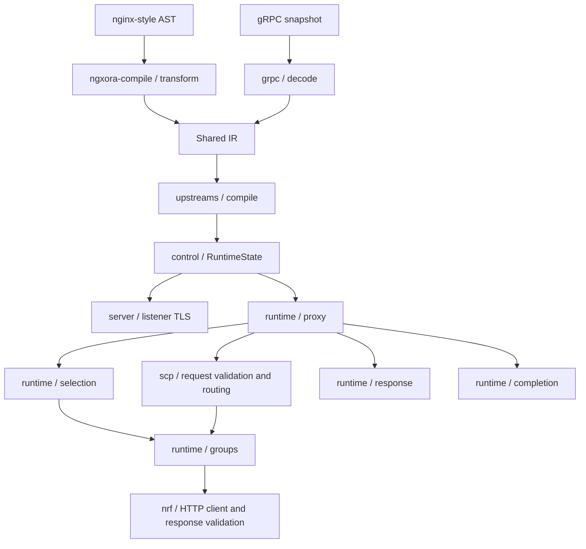

# Code architecture

The configuration adapters feed one compiled routing model. Request execution
uses a captured runtime snapshot; it does not parse text configuration, protobuf
messages or Kubernetes resources.

## Where changes belong

Paths below are relative to `crates/ngxora-runtime/src`, except for text lowering.

| Responsibility | Module |
| --- | --- |
| Text AST to IR | `ngxora-compile/src/transform.rs` and `transform/`: listeners, locations, upstreams, plugin configuration and scalar parsing |
| Authenticated management transport | `grpc.rs`: TCP mTLS, UDS permissions and service methods |
| Protobuf import/export | `grpc/decode.rs`, `encode.rs`, `tls.rs`, `http_routes.rs`, `values.rs` |
| Listener topology compilation | `upstreams/compile.rs` |
| Route and upstream validation | `upstreams/compile/routes.rs`, `upstream_groups.rs` |
| Snapshot publication and background services | `control.rs` |
| Listener binding and readiness | `server.rs`; OpenSSL handshake callbacks in `server/openssl_listener_tls.rs` |
| Request state and public proxy types | `upstreams/runtime.rs` |
| Pingora request/response lifecycle | `upstreams/runtime/proxy.rs` |
| Route and backend target selection | `upstreams/runtime/selection.rs` |
| Balancing, health checks and group state | `upstreams/runtime/groups.rs` |
| NRF expiry/refresh and service priority/capacity | `upstreams/runtime/groups/discovery.rs`, `topology.rs` |
| Upstream TLS material and peer options | `upstreams/runtime/tls.rs` |
| Request body accounting | `upstreams/runtime/limits.rs` |
| Plugin header adapters and response framing | `upstreams/runtime/response.rs` |
| Completion telemetry and cache commit | `upstreams/runtime/completion.rs` |
| Cache storage and eligibility | `cache.rs` |
| SBI input validation | `upstreams/scp/request.rs` |
| SCP discovery cache, selection and exchange | `upstreams/scp.rs` |

Private child modules keep implementation details behind the existing public
facades. A helper shared by siblings is normally `pub(super)`; upstream-wide
SCP integration uses `pub(in crate::upstreams)`. Configuration conversion must
not acquire runtime dependencies or perform request-time network operations.

## Security boundaries to preserve

- Protobuf input goes through IR compilation before `ApplySnapshot` publishes
  anything. Invalid updates leave the active snapshot in place; listener topology
  changes retain the restart boundary.
- TCP management requires client-certificate verification. Local UDS permissions
  remain owner-only. Moving conversion code must not bypass either transport.
- `request_filter` captures the snapshot and resolves the route before route
  access rules and request plugins. These checks precede cache lookup and
  upstream selection or SCP discovery. Body limits and ACME challenges have
  their existing early handling in the same lifecycle method.
- `response` applies response plugins once to local replies and explicitly
  finishes empty HTTP/2 responses. Cached replies already contain processed
  headers; they do not repeat response hooks.
- `completion` commits only responses accepted by the existing cache policy and
  skips writes after proxy errors. Keep that decision tied to request completion.
- SCP validates apiRoots and selectors before discovering or selecting a
  destination. Preserve cache/concurrency limits, bounded stale discovery,
  allowed-target checks and the restriction on replaying requests.
- TLS identity loading, trust configuration and SNI selection remain separate
  from URL/Host rewrites. A rewrite does not change the trusted TLS identity.

## Verification

`make test` runs unit tests, config examples, the Go SDK tests and the HTTPRoute
and NRF/SCP process suites. `make lint` checks formatting. Compiler, gRPC and
upstream unit suites are grouped by responsibility under their `tests/` modules;
cache and NRF client tests live beside their implementations.

`make test-open5gs` is the separate scheduled/manual interoperability suite.
The Dockerfile copies the full source tree and builds the release binary;
new Rust child modules must be tracked and included in that build context.

See [ADRs](adr/README.md) for design decisions and the
[snapshot schema](snapshot-schema.md) for the external contract.
